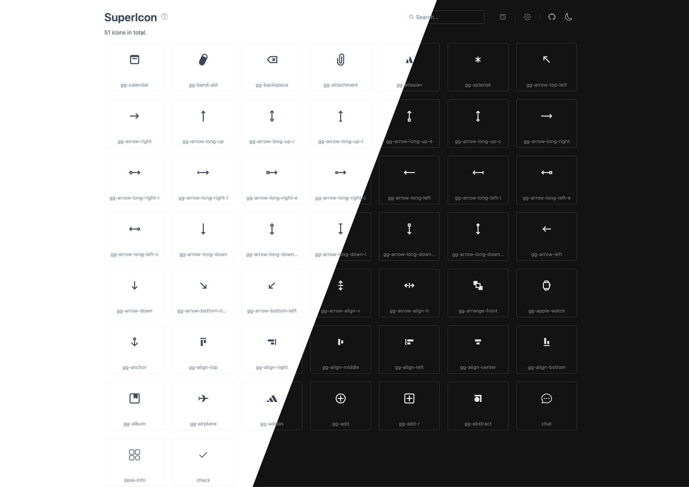

# vite-plugin-supericon




[中文](./README.zh.md)

Turn a folder of SVGs into ready-to-use icons at build time, with a live preview and management UI baked into your dev server. Point the plugin at a directory, keep dropping `.svg` files into it, and use them straight away — no manual export step, no icon build script to maintain.

## Features

- **One line to get started** — point at a directory and go.
- **Two delivery formats** — generate an **icon font** (via [fantasticon](https://github.com/tancredi/fantasticon#readme)) and/or an **SVG sprite**. Use one or both.
- **Two consumption styles** — CSS classes (`class="icon-home"`) or tree-shakeable Vue components (`import { IconHome }`).
- **Built-in preview UI** at `/__supericon/` — search, filter, sort, copy the usage snippet, and diff the source SVG against the rendered glyph.
- **Hot reload** — add, edit, or delete an SVG and the icons regenerate automatically.
- **One-click repair** — fix problematic SVGs right in the UI and save back to disk.
- **Editor autocomplete** via [Iconify IntelliSense](https://marketplace.visualstudio.com/items?itemName=antfu.iconify) in VS Code.

## Install

```shell
# npm
npm i vite-plugin-supericon -D

# yarn
yarn add vite-plugin-supericon -D

# pnpm
pnpm add vite-plugin-supericon -D
```

## Quick start

Add the plugin to your Vite config and point it at your icon folder. At least one of `font` / `svg` is required — you can enable either or both.

```ts
// vite.config.ts
import { defineConfig } from 'vite'
import { superIcon } from 'vite-plugin-supericon'

export default defineConfig({
  plugins: [
    superIcon({
      font: { dir: './src/assets/icons' } // SVGs → icon font
      // svg: { dir: './src/assets/svgicons' } // SVGs → sprite (optional)
    })
  ]
})
```

Import the runtime once in your entry file. This is a side-effect import that injects the font stylesheet and/or the sprite into the page:

```ts
// main.ts
import 'virtual:supericon/register'
```

Start the dev server and open the preview UI at `http://localhost:5173/__supericon/` (also printed in the terminal). Use the icons anywhere:

```html
<!-- font icon: class is `${prefix}-${filename}`, prefix defaults to `icon` -->
<i class="icon-home"></i>

<!-- sprite icon: reference the symbol by id -->
<svg><use href="#icon-home" /></svg>
```

> A complete setup lives in [`demo`](./demo/).

## Consumption modes

The plugin exposes two mutually exclusive modes via the `mode` option.

### `class` mode (default)

`virtual:supericon/register` injects the assets globally; you reference icons by name in your markup.

```ts
// vite.config.ts
superIcon({ font: { dir: './src/assets/icons' } })
```

```ts
// main.ts
import 'virtual:supericon/register'
```

```html
<i class="icon-home"></i>
<svg><use href="#icon-home" /></svg>
```

### `import` mode

Each icon is exported as a tree-shakeable Vue component. Only the icons you actually import end up in your bundle, and the sprite is trimmed to the symbols you use.

```ts
// vite.config.ts
superIcon({
  mode: 'import',
  font: { dir: './src/assets/icons' },
  svg: { dir: './src/assets/svgicons' }
})
```

```ts
// main.ts — run the side-effect init once (loads font css + sprite)
import 'virtual:supericon/register'
```

```vue
<script setup lang="ts">
// `home.svg` → IconHome, `arrow-left.svg` → IconArrowLeft
import { IconHome, IconArrowLeft } from 'virtual:supericon'
</script>

<template>
  <IconHome />
  <IconArrowLeft :size="32" color="#3b82f6" />
</template>
```

Every generated component accepts `size` (default `1em`) and `color` (default: inherit).

In `import` mode a type declaration file (`supericon.d.ts` by default) is written to your project root so the virtual module resolves and autocompletes. Make sure it is covered by your `tsconfig.json`:

```jsonc
{
  "include": ["src", "supericon.d.ts"]
}
```

> Export names must be globally unique across all source directories in `import` mode. Duplicate names (e.g. two `home.svg` in different folders) fail the build with a clear conflict message.

## Iconify IntelliSense (VS Code)

The plugin writes an `iconify.json` collection into the cache dir. Point the [Iconify IntelliSense](https://marketplace.visualstudio.com/items?itemName=antfu.iconify) extension at it for in-editor previews:

```jsonc
// .vscode/settings.json
{
  "iconify.customCollectionJsonPaths": ["node_modules/.supericon/iconify.json"]
}
```

## Options

```ts
superIcon({
  prefix: 'icon',
  mode: 'class',
  font: { dir: './src/assets/icons' },
  svg: { dir: './src/assets/svgicons' }
})
```

### Top level

| Option       | Type                  | Default              | Description                                                                             |
| ------------ | --------------------- | -------------------- | --------------------------------------------------------------------------------------- |
| `font`       | `FontOptions`         | —                    | Icon-font track. See below. At least one of `font` / `svg` is required.                 |
| `svg`        | `SvgOptions`          | —                    | SVG-sprite track. See below.                                                            |
| `mode`       | `'class' \| 'import'` | `'class'`            | Consumption mode (see above). Mutually exclusive.                                       |
| `prefix`     | `string`              | `'icon'`             | Shared prefix for font CSS classes and sprite symbol ids (`${prefix}-${filename}`).     |
| `dts`        | `string \| false`     | `'supericon.d.ts'`   | `import` mode only. Path (relative to root) for the generated declaration; `false` off. |
| `base`       | `string`              | Vite's `base`        | Base URL the preview UI is mounted under.                                               |
| `watch`      | `boolean`             | `true`               | Regenerate icons when source SVGs change.                                               |
| `clearCache` | `boolean`             | `true`               | Clear the cache dir before the server starts.                                           |
| `open`       | `boolean`             | `false`              | Open the preview UI in the browser on start.                                            |
| `silent`     | `boolean`             | `false`              | Don't print the preview UI URL in the terminal.                                         |

### `font` options

| Option       | Type      | Default      | Description                                                                     |
| ------------ | --------- | ------------ | ------------------------------------------------------------------------------- |
| `dir`        | `string`  | —            | **Required.** Source folder of SVGs to convert into a font.                     |
| `name`       | `string`  | `'iconfont'` | Font file basename and CSS `font-family`.                                       |
| `fontHeight` | `number`  | `300`        | Height (in font units) icons are scaled to; higher is crisper.                  |
| `normalize`  | `boolean` | `true`       | Scale every icon to a uniform height regardless of source size.                 |
| `descent`    | `number`  | —            | Distance below the baseline; tweaks vertical alignment.                         |
| `round`      | `number`  | —            | Round SVG path coordinates to this precision.                                   |
| `tag`        | `string`  | `'i'`        | HTML tag used by the generated CSS base selector.                               |
| `selector`   | `string`  | `null`       | Custom base CSS selector; falls back to `tag` when unset.                       |

### `svg` options

| Option       | Type                    | Default    | Description                                                                                    |
| ------------ | ----------------------- | ---------- | --------------------------------------------------------------------------------------------- |
| `dir`        | `string`                | —          | **Required.** Source folder of SVGs to bundle into a sprite.                                   |
| `spriteName` | `string`                | `'sprite'` | Sprite file basename (no extension).                                                           |
| `inject`     | `'fetch' \| 'inline'`   | `'fetch'`  | `fetch` loads the sprite at runtime; `inline` embeds it in the module for synchronous inject.  |
| `svgo`       | `boolean \| SvgoConfig` | `true`     | SVGO optimization: `true` = preset-default (keeps `viewBox`), `false` = off, or a full config. |

> Internal ids inside each SVG are namespaced per symbol automatically to prevent id/color bleed between multi-color icons. If you pass a custom `svgo` config, keep `removeViewBox: false`.

<details>
<summary>Deprecated options</summary>

The top-level `srcDir` and `name` still work but are mapped to the font track with a warning. Use `font.dir` / `font.name` instead.

| Option   | Replacement |
| -------- | ----------- |
| `srcDir` | `font.dir`  |
| `name`   | `font.name` |

</details>

## How it works

- SVGs are compiled once into `node_modules/.supericon` (the cache dir, not your build output).
- In dev, assets are served from that cache; in production they are emitted as regular Vite assets with hashed URLs.
- The sprite is tree-shaken during the build: only the `<symbol>`s actually referenced in your code are kept.
- The preview UI talks to the plugin over Vite's WebSocket, so it stays in sync as you edit icons.

## License

[MIT](https://opensource.org/licenses/MIT)
