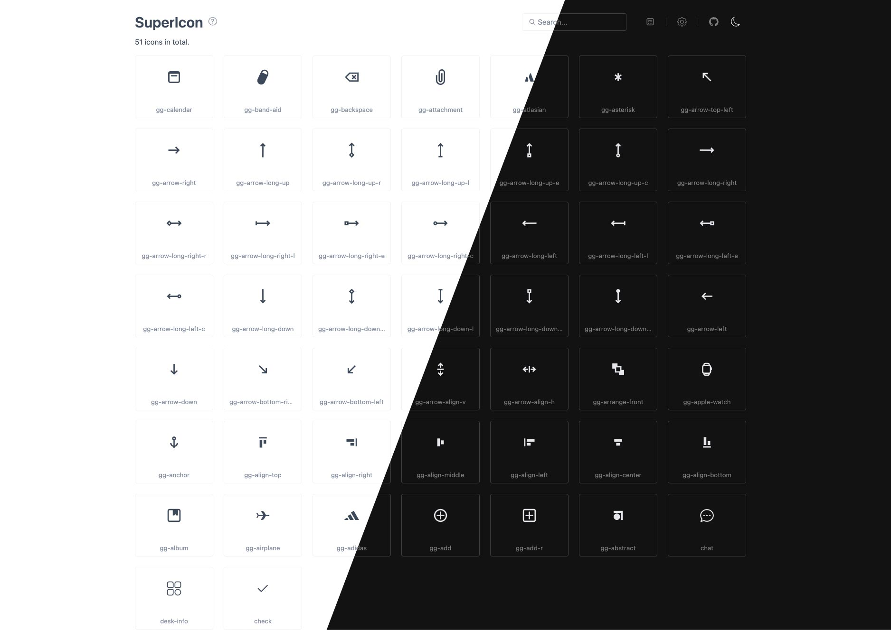

# vite-plugin-supericon




[English](./README.md)

将项目中的 svg 纯色图标转换为字体图标, 并提供交互界面. 核心由 [fantasticon](https://github.com/tancredi/fantasticon#readme) 实现.

## ✨ Features

1. 仅需一行配置即可轻松使用
2. 自动将 SVG 转换为 Iconfont
3. 提供精美的交互式用户界面
4. 快速复制图标代码功能
5. 支持原始图与渲染图的对比, 快速检查差异
6. 智能提示重复图标
7. 多种图标排序和筛选选项
8. 支持在 VSCode [Iconify IntelliSense](https://marketplace.visualstudio.com/items?itemName=antfu.iconify) 中预览生成的图标

## 📦 Install

```shell
npm i vite-plugin-supericon -D

# yarn
yarn add vite-plugin-supericon -D

# pnpm
pnpm add vite-plugin-supericon -D
```

## 🦄 Usage

1. 添加并配置 superIcon 插件到 `vite.config.js` / `vite.config.ts`

```ts
// vite.config.js / vite.config.ts
import { superIcon } from 'vite-plugin-supericon'

export default {
  plugins: [
    superIcon({
      srcDir: './src/assets/icons'
    })
  ]
}
```

2. 在入口文件中引入模块

```ts
// main.ts / main.js
import 'virtual:supericon'
```

3. 然后运行服务, 通过终端点击链接或直接打开 `localhost:5173/__supericon/` 访问交互式界面

> 完整使用 demo 可参考 [demo](./demo/)

## 😀 Iconify IntelliSense 支持

配置工作区的 vscode 设置

```json
// .vscode/setting.json
{
  "iconify.customCollectionJsonPaths": ["node_modules/.supericon/iconify.json"]
}
```

## Options

| 属性名     | 属性类型 | 是否可选 | 默认值             | 属性描述                                                       |
| ---------- | -------- | -------- | ------------------ | -------------------------------------------------------------- |
| clearCache | boolean  | 是       | true               | 在服务器启动前清除缓存                                         |
| watch      | boolean  | 是       | true               | 监视 srcDir 文件变化                                           |
| base       | string   | 是       | 从 Vite 配置中读取 | 超级图标 UI 的基础 URL                                         |
| open       | boolean  | 是       | false              | 自动在浏览器中打开超级图标页面                                 |
| silent     | boolean  | 是       | false              | 在终端中静默打印 URL 输出                                      |
| srcDir     | string   | 否       |                    | SVG 图标源文件夹                                               |
| name       | string   | 是       | iconfont           | 图标字体的名称                                                 |
| prefix     | string   | 是       | icon               | 图标 CSS 类前缀                                                |
| fontHeight | number   | 是       | 300                | 输出字体的高度（图标将按比例缩放，使最高字体的高度等于此高度） |
| descent    | number   | 是       |                    | 字体下降                                                       |
| round      | number   | 是       | icon               | 设置 SVG 路径四舍五入 [10e12]                                  |
| selector   | string   | 是       | null               | 使用 CSS 选择器而不是 "标签 + 前缀"。                          |

## License

[MIT licenses](https://opensource.org/licenses/MIT)
